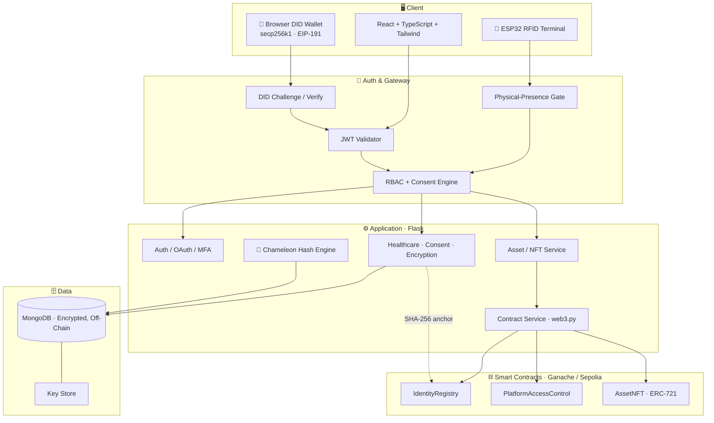
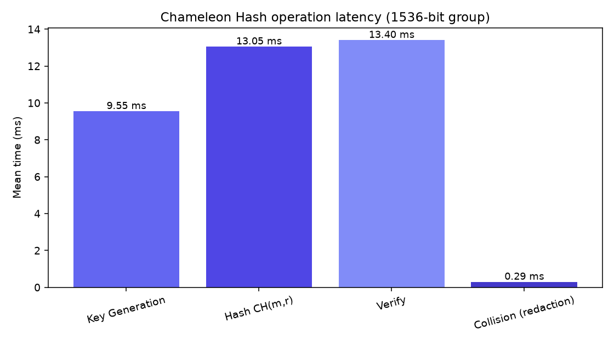

<div align="center">


# Blockchain Platform for Identity, Access Control & Digital-Asset Ownership
### built on a DPDP-Compliant, Privacy-First Healthcare Foundation

<a href="https://git.io/typing-svg">
  
</a>

<p>
  <em>A trustless platform where identities are cryptographically verifiable, access is
  enforced by smart contracts, and digital-asset ownership lives on-chain as NFTs —
  while all sensitive data stays <strong>encrypted and off-chain</strong>.</em>
</p>

<p>
  <a href="https://github.com/Bennyhinn007/DPDP-Compliant-Blockchain-Based-Personal-Data-Protection-and-Consent-Management-System/actions/workflows/ci.yml">
    
  </a>
  
  
  
  
  
</p>

<p>
  
  
  
  
  
  
  
  
  
</p>

</div>

---

## 🎯 What this is

This project answers **SIH 2026 Problem Statement 26125 (Bharat Electronics Limited)** —
*"Blockchain-Based Secure Platform for Identity, Access Control, and Digital Asset
Management"* — and builds it on top of a **real, working DPDP-compliant privacy
platform**.

Centralized identity systems are a single point of failure: one breach of the
password store exposes everyone, and asset ownership scattered across disconnected
systems is hard to verify. This platform removes that weakness:

- **No central password store to steal** — users prove identity with a private key held on their own device.
- **Access enforced on-chain** — smart contracts, not just the app, decide who can do what.
- **Ownership is provable and un-fakeable** — digital assets are NFTs bound to identities.
- **Privacy is preserved** — sensitive/personal data stays encrypted off-chain; only proofs go on-chain.

> ### Core principle: **Privacy Off-Chain · Trust On-Chain**
> Health/personal data is AES-256 encrypted in MongoDB. Only hashes, DIDs, roles,
> token IDs, ownership references, and events touch the blockchain. **Healthcare
> records are never NFTs and never stored on-chain.**

<div align="center">

| 🪪 Decentralized ID | 🛡️ On-Chain RBAC | 🎟️ NFT Ownership | 🔐 Privacy-First |
|:---:|:---:|:---:|:---:|
| secp256k1 DID + passwordless login (+ optional RFID 2FA) | Admin / Manager / Auditor / User enforced by smart contract | ERC-721 assets linked to identities | Encrypted off-chain data · no PHI on-chain |

</div>

---

## 🧩 The two layers (Add, Don't Replace)

The platform is **one system with two cohesive layers** that share a single backend,
database, and UI:

```
        DPDP Healthcare Privacy Platform  (existing, primary foundation)
                              +
   DID Identity  +  On-Chain RBAC  +  NFT Asset Ownership  +  Smart Contracts
                              +
                     Immutable Dual Audit
                              =
              Unified Secure Identity & Asset Platform
```

- The **SIH identity/access/asset layer** is fully **additive** — it never renames or
  removes existing healthcare roles or workflows.
- It is **feature-flagged** (`SIH_FEATURES_ENABLED`): disable it and the pure DPDP
  healthcare platform runs unchanged.
- A **DID is optional per user** — anyone without one uses every existing workflow as before.

---

## 🚀 Feature Highlights

### 🔗 SIH 26125 — Identity, Access & Digital Assets

| Feature | What it does |
|---------|--------------|
| 🪪 **Decentralized Identity (DID)** | Client-side `secp256k1` keypair → `did:rakshaid:<id>`; the **private key never leaves the browser** *(prototype DID method)* |
| 🔑 **Passwordless DID Login** | Log in by signing an **EIP-191** challenge — no password sent; issues the same JWT as normal login |
| 🪪➕ **Optional RFID 2FA** | Config flag adds a **physical card tap** as a second factor to DID login (key + presence) |
| 🛡️ **On-Chain RBAC** | `PlatformAccessControl` is the single role authority; critical ops are **dual-enforced** (backend **and** contract) |
| 🎟️ **ERC-721 Digital Assets** | `AssetNFT` — admin-gated mint, assign, controlled transfer; each NFT bound to an owner DID |
| 🚫 **No-PHI Guard** | Rejects any asset metadata that looks like personal/medical data — records can never become NFTs |
| ⛓️ **Dual Audit** | Every contract event is recorded **on-chain** and in the existing hash-chained log |
| 🌐 **Ganache + Sepolia** | Deploys to local Ganache; **Sepolia-ready** via env-configured addresses *(supported, not auto-deployed)* |

### 🩺 DPDP Healthcare Privacy Foundation

| Feature | What it does |
|---------|--------------|
| 🦎 **Real Chameleon Hashing** | `CH(m,r) = g^m·y^r mod p` — authorized redaction via trapdoor collision, benchmarked *(real primitive; redaction workflow is a simulation layer)* |
| 🔒 **AES-256 Field Encryption** | Fernet field-level encryption; MongoDB stores ciphertext only |
| 📜 **Consent Management** | 6 consent types with blockchain-anchored receipts; grant / modify / withdraw |
| ⛓️ **SHA-256 Anchoring** | Record integrity anchored on Ganache **or** Sepolia (separate subsystem from SIH keccak256) |
| 🪪 **RFID Physical-Presence** | ESP32 + RC522 card tap gates sensitive/DPO actions |
| 🔑 **Google OAuth + MFA** | Passwordless Google sign-in and TOTP MFA alongside email/password |
| 📊 **Compliance Scoring** | Real-time DPDP compliance score (0–100) with breakdown |

---

## 🏗️ Architecture



> **Dual authorization + dual audit:** critical actions are checked by the backend
> **and** the smart contract, and recorded in both the hash-chained log and on-chain
> events. If the chain is unreachable, reads degrade gracefully (HTTP 200,
> `chain_available:false`) and critical writes **fail closed** (HTTP 503) — the
> healthcare platform never depends on chain availability.

---

## 🔐 How passwordless DID login works

```
1. (optional 2FA) Tap RFID card ── records a 120s physical-presence token
2. Client asks backend for a one-time challenge         POST /api/v1/did/challenge
3. Browser signs the challenge with the DID private key (EIP-191, key stays local)
4. Backend recovers the signer, checks it matches the DID's registered public key,
   (optionally) confirms the RFID tap, then issues the SAME JWT as password login
                                                        POST /api/v1/did/verify
```

Even if a device is fully compromised and the key is stolen, enabling RFID 2FA
(`SIH_DID_LOGIN_REQUIRE_RFID`) means the attacker still cannot log in without the
physical card — and any DID can be **instantly revoked**.

---

## 🧠 Cryptography at a glance

| Purpose | Primitive | Notes |
|---|---|---|
| Identity keys | **secp256k1 (ECDSA)** | keypair generated client-side; private key never sent |
| DID login | **EIP-191 `personal_sign`** | verified with `eth-account.recover_message` |
| On-chain SIH hashes (DID / pubkey / metadata) | **keccak256** → bytes32 | native to Solidity |
| Healthcare record anchoring | **SHA-256** | separate, unchanged subsystem |
| Data at rest | **AES-256 (Fernet)** | MongoDB stores ciphertext only |
| Redactable blockchain | **1536-bit chameleon hash** | real primitive; redaction *workflow* is a simulation layer |

> keccak256 (SIH) and SHA-256 (healthcare anchoring) are intentionally **separate**
> subsystems — not interchangeable.

---

## 📈 Chameleon Hash Benchmarks

Real measured performance of the 1536-bit scheme (see [`backend/benchmarks`](backend/benchmarks)):

<div align="center">
  
</div>

| Operation | Mean time | Note |
|-----------|-----------|------|
| Key generation | ~9 ms | one-time setup |
| Hash `CH(m,r)` | ~13 ms | size-independent (SHA-256 pre-compression) |
| Verify | ~13 ms | — |
| **Collision (authorized redaction)** | **~0.25 ms** | **~50× faster than hashing, constant regardless of record size** |

> Reproduce: `python -m benchmarks.benchmark_chameleon --iterations 100`

---

## 🛠️ Tech Stack

<div align="center">

**Frontend** · React 18 · TypeScript · Vite · Tailwind CSS · TanStack Query · Recharts · Framer Motion
**Backend** · Flask 3 · Python 3.13 · PyJWT · bcrypt · google-auth · eth-account / eth-keys
**Smart Contracts** · Solidity 0.8.24 · OpenZeppelin v5 · Hardhat
**Chain** · Web3.py · Ganache (dev) · Ethereum Sepolia (testnet-ready)
**Data** · MongoDB 7 · AES-256 (Fernet)
**Hardware** · ESP32 · RC522 RFID
**Quality** · pytest + mongomock (214 tests) · Hardhat (20 tests) · GitHub Actions CI

</div>

---

## ⚡ Quick Start

<details open>
<summary><strong>Backend + Frontend (core platform)</strong></summary>

```bash
# Clone
git clone https://github.com/Bennyhinn007/DPDP-Compliant-Blockchain-Based-Personal-Data-Protection-and-Consent-Management-System.git
cd dpdp_kiro

# ── Backend (API on :5000) ──
cd backend
python -m venv venv
venv\Scripts\activate           # Windows  (source venv/bin/activate on macOS/Linux)
pip install -r requirements.txt
cp .env.example .env            # then fill in your values
python -m app.db_init           # initialize MongoDB collections
python seeds/seed_demo.py       # seed demo data
python run.py                   # start API

# ── Frontend (UI on :5173) ──  (new terminal)
cd frontend
npm install
cp .env.example .env            # optional: add VITE_GOOGLE_CLIENT_ID
npm run dev
```
</details>

<details>
<summary><strong>Smart contracts (enable on-chain SIH features)</strong></summary>

```bash
# Start a local chain (deterministic = stable addresses across restarts)
npx ganache --deterministic --chain.chainId 1337

# Deploy the three contracts + export ABIs to the backend
cd contracts
npm install
npx hardhat run scripts/deploy.js --network ganache

# Copy the printed addresses into backend/.env, then restart the backend:
#   SIH_ACCESS_CONTROL_ADDRESS=0x...
#   SIH_IDENTITY_REGISTRY_ADDRESS=0x...
#   SIH_ASSET_NFT_ADDRESS=0x...
```

See [`docs/sih-contracts-deploy.md`](docs/sih-contracts-deploy.md) for Sepolia.
Until addresses are set, on-chain **writes fail closed** (HTTP 503) by design —
DID *creation* and *login* still work off-chain.
</details>

<details>
<summary><strong>Run the tests (no external services needed)</strong></summary>

```bash
# Backend — self-contained via in-memory mongomock
cd backend
pytest -q                        # 214 passed, 1 skipped

# Smart contracts
cd contracts
npx hardhat test                 # 20 passing
```
</details>

<details>
<summary><strong>Docker</strong></summary>

```bash
docker-compose up --build
```
</details>

---

## 🔑 Demo Credentials

| Email | Password | Role |
|-------|----------|------|
| `admin@dpdp-health.in` | `Admin@Secure123` | Admin / DPO |
| `rajesh.kumar@gmail.com` | `Patient@123` | Patient |
| `priya.sharma@gmail.com` | `Patient@456` | Patient |

> **API docs:** Swagger UI at `http://localhost:5000/api/docs/` · Health at `/health`
> **Try DID login:** log in normally → **Identity Center** → *Create My DID* → log out → **Sign in with DID (passwordless)**.

---

## 🧪 Key API Endpoints

<details>
<summary><strong>Identity, Access & Digital Assets (SIH 26125)</strong></summary>

| Method | Endpoint | Auth | Description |
|--------|----------|------|-------------|
| POST | `/api/v1/did` | User | Create a DID for the current user |
| POST | `/api/v1/did/challenge` | — | Get a one-time login challenge |
| POST | `/api/v1/did/verify` | — | Verify signature → issue JWT (optional RFID 2FA) |
| POST | `/api/v1/did/:did/revoke` | Admin/DPO | Revoke a DID |
| GET | `/api/v1/roles/matrix` | User | On-chain role matrix + chain status |
| POST | `/api/v1/assets` | Admin/Mgr | Register a digital asset (encrypted off-chain) |
| POST | `/api/v1/nft/mint` | Admin | Mint an NFT to a DID (fail-closed if chain down) |
| GET | `/api/v1/nft/:id/verify` | User | Verify ownership + metadata hash |
| GET | `/api/v1/blockchain/events` | Admin | Cached on-chain contract events |

</details>

<details>
<summary><strong>Healthcare, Consent & Integrity (DPDP)</strong></summary>

| Method | Endpoint | Auth | Description |
|--------|----------|------|-------------|
| POST | `/api/v1/auth/login` | — | Login → JWT |
| POST | `/api/v1/auth/google` | — | Google OAuth login |
| POST | `/api/v1/auth/rfid-verify` | — | Verify an RFID card tap |
| GET | `/api/v1/patients/me/records` | Patient | Own health records |
| POST | `/api/v1/patients/me/records/:id/correct` | Patient | Correct record (DPDP §12) |
| POST | `/api/v1/patients/me/records/:id/erase` | Patient | Erase record (RFID-gated) |
| GET | `/api/v1/patients/me/records/:id/lifecycle` | Patient | Record Lifecycle Story |
| POST | `/api/v1/integrity/tamper-demo` | Patient | Live tamper-attempt demo |
| POST | `/api/v1/consents/grant` | Patient | Grant consent |
| GET | `/api/v1/compliance/compliance-score` | Admin | DPDP compliance score |

</details>

---

## ⚖️ DPDP Act Compliance Mapping

| DPDP Section | Right / Obligation | Implementation |
|---|---|---|
| §5–6 | Consent | 6 consent types, receipts, blockchain-anchored |
| §11 | Right to Access | Personal Data Center + data export |
| §12 | Right to Correction | Chameleon-hash correction workflow |
| §12 | Right to Erasure | Chameleon-hash redaction (RFID-gated) |
| §8(4) | Security Safeguards | AES-256, RBAC, DID keys, physical-presence auth |
| §8(6) | Breach Notification | Severity-tagged audit trail |

See the full [**Threat Model & Security Analysis**](docs/threat-model.md).

---

## 🔬 Research Contribution

A unified architecture combining:

1. **Decentralized identity** with client-side keys and EIP-191 passwordless login
2. **Smart-contract-enforced RBAC** as a single on-chain role authority (dual-enforced)
3. **NFT digital-asset ownership** bound to DIDs, with a no-PHI guard
4. **Privacy-preserving design** — encrypted off-chain data, hashes-only on-chain
5. **Real chameleon-hash functions** for authorized, verifiable blockchain redaction
6. **Hardware step-up auth** — RFID physical presence as an optional second factor
7. **Dual audit** — hash-chained log **+** immutable on-chain events

The system makes abstract cryptography *tangible*: evaluators watch a passwordless
key-based login, an on-chain-verified asset transfer, and a lawful record correction
that keeps its blockchain anchor valid — while a tamper attempt gets caught.

---

## 📁 Project Structure

The repo has two cohesive layers. The **DPDP healthcare platform** is the primary
system; the **SIH 26125 identity/asset extension** (DID + smart contracts + NFTs)
is layered on top — *add, don't replace*. Both share one backend, database, and UI.

```
dpdp_kiro/
├── backend/                          # Flask 3 · Python 3.13 API
│   ├── app/
│   │   ├── __init__.py               # App factory + blueprint registration
│   │   ├── config.py                 # Env config (incl. SIH_* feature flags)
│   │   ├── db_init.py                # Collection + index bootstrap
│   │   ├── extensions.py             # MongoDB + Web3 init
│   │   ├── blueprints/               # HTTP routes (one package per domain)
│   │   │   ├── auth/                 #   login, Google OAuth, MFA, RFID verify
│   │   │   ├── patients/  doctors/  pharmacy/
│   │   │   ├── consents/             #   DPDP consent lifecycle + receipts
│   │   │   ├── integrity/            #   record verification + tamper demo
│   │   │   ├── blockchain/           #   hash anchoring + contract events
│   │   │   ├── audit/  compliance/
│   │   │   ├── did/                  # ── SIH: DID create / login / revoke
│   │   │   ├── roles/                # ── SIH: on-chain RBAC (Admin/Manager/…)
│   │   │   ├── assets/               # ── SIH: digital-asset registration
│   │   │   └── nft/                  # ── SIH: ERC-721 mint / assign / transfer
│   │   ├── services/                 # Business logic
│   │   │   ├── chameleon_crypto.py   #   real 1536-bit chameleon-hash primitive
│   │   │   ├── chameleon_hash_service.py  # redaction workflow (simulation layer)
│   │   │   ├── encryption_service.py #   AES-256 (Fernet) field encryption
│   │   │   ├── blockchain_service.py #   SHA-256 anchoring (Ganache/Sepolia)
│   │   │   ├── consent_service.py  patient_service.py  audit_service.py  …
│   │   │   ├── did_service.py        # ── SIH: keypair/DID + EIP-191 verify
│   │   │   ├── contract_service.py   # ── SIH: web3 wrapper (graceful degrade)
│   │   │   └── asset_nft_service.py  # ── SIH: encrypted metadata + keccak256
│   │   ├── middleware/               # JWT, RBAC, audit, physical-presence
│   │   └── utils/                    # constants, errors, helpers
│   ├── benchmarks/                   # Chameleon-hash benchmark harness + results
│   ├── seeds/                        # Demo data + RFID card enrollment
│   └── tests/                        # Self-contained tests (mongomock) — 214 passing
│
├── contracts/                        # ── SIH: Solidity (Hardhat + OpenZeppelin v5)
│   ├── src/
│   │   ├── IdentityRegistry.sol      #   on-chain DID registry (identity only)
│   │   ├── PlatformAccessControl.sol #   single role authority (RBAC)
│   │   └── AssetNFT.sol              #   ERC-721 digital-asset ownership
│   ├── test/                         #   Hardhat tests (20 passing)
│   ├── scripts/deploy.js             #   deploy + export ABIs to backend
│   └── hardhat.config.js             #   Ganache + Sepolia networks
│
├── frontend/                         # React 18 · TypeScript · Vite · Tailwind
│   └── src/
│       ├── pages/                    # Feature pages by role
│       │   ├── auth/                 #   login (password · Google · DID + RFID 2FA)
│       │   ├── patient/  doctor/  dpo/  admin/  shared/
│       │   ├── identity/             # ── SIH: Identity Center (create DID)
│       │   ├── access/               # ── SIH: Access Control Center (roles)
│       │   └── assets/               # ── SIH: Digital Asset Center (NFTs)
│       ├── components/               # UI + shared (LifecycleStory, TamperDemo, …)
│       ├── contexts/                 # AuthContext (password · Google · DID login)
│       ├── services/                 # API client layer (…, identityService,
│       │                             #   assetService for SIH)
│       └── lib/                      # wallet.ts (keypair + EIP-191 signing)
│
├── hardware/                         # ESP32 + RC522 RFID terminal firmware
├── docs/                             # threat-model, demo-script, deployment,
│                                     #   setup-guide, sih-contracts-deploy, pitch/
└── .github/workflows/                # CI pipeline
```

> Legend: lines marked **`── SIH`** are the additive identity/access/asset
> extension for SIH PS 26125. Everything else is the original DPDP healthcare
> platform and runs standalone when SIH features are disabled.

---

## 📚 Standards & References

- **W3C DID Core** — decentralized identifier model — https://www.w3.org/TR/did-core/
- **EIP-721** — ERC-721 NFT standard (`AssetNFT`) — https://eips.ethereum.org/EIPS/eip-721
- **EIP-191** — signed-data format for DID login — https://eips.ethereum.org/EIPS/eip-191
- **OpenZeppelin Contracts v5** — audited RBAC / ERC-721 / ReentrancyGuard — https://docs.openzeppelin.com/contracts/5.x/
- **DPDP Act, 2023 (India)** — privacy & consent foundation — https://www.meity.gov.in/data-protection-framework
- **Chameleon Signatures** — Krawczyk & Rabin (2000) · **Redactable Blockchain** — Ateniese et al. (2017)
- **SIH PS 26125** — Bharat Electronics Limited · Theme: Blockchain & Cybersecurity — https://www.sih.gov.in/

---

## 📝 Honest labeling

- The `did:rakshaid:` DID method is a **project-specific prototype**, not an interoperable production DID network (e.g. ION/Sovrin).
- The chameleon-hash **primitive is real and benchmarked**; the redaction **workflow** is a simulation layer for demonstration.
- Sepolia is **supported and deployable** (config + deploy script + docs); it is not auto-deployed by this repo.
- Browser key custody is **prototype-grade** (localStorage); hardware-wallet / HSM custody is noted future work.

---

<div align="center">

**One platform: verifiable identity, un-bypassable access, and provable ownership —
with privacy kept off-chain and trust kept on-chain.**

<sub>Academic Project · SIH 2026 PS 26125 · All Rights Reserved · India 🇮🇳 · DPDP Act 2023</sub>

</div>
