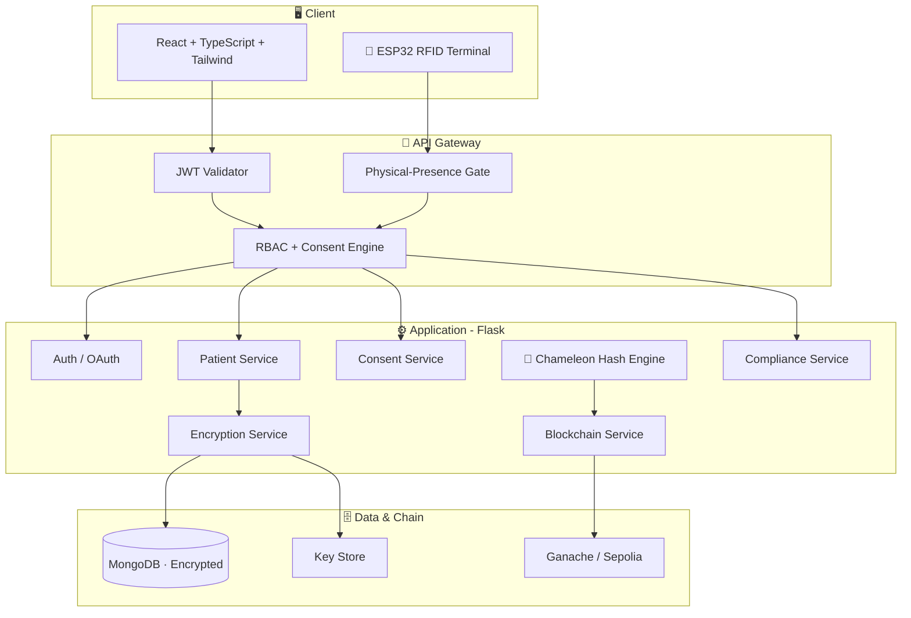

<div align="center">


# DPDP-Compliant Redactable Blockchain Healthcare Platform

<a href="https://git.io/typing-svg">
  
</a>

<p>
  <em>A production-grade healthcare platform that reconciles blockchain immutability with the
  right to correction &amp; erasure — using <strong>genuine cryptographic chameleon hashing</strong>,
  not a simulation.</em>
</p>

<p>
  <a href="https://github.com/Bennyhinn007/DPDP-Compliant-Blockchain-Based-Personal-Data-Protection-and-Consent-Management-System/actions/workflows/ci.yml">
    
  </a>
  
  
  
</p>

<p>
  
  
  
  
  
  
  
</p>

</div>

---

## ✨ Why this project is different

> Traditional blockchains are **immutable** — great for integrity, but in direct conflict with the DPDP Act's **right to correction and erasure**. This platform resolves that tension with a **real discrete-log chameleon hash**: authorized edits produce a trapdoor *collision*, so the record content changes while its on-chain anchor stays valid. Unauthorized edits still break verification.

<div align="center">

| 🔐 Real Crypto | 🩺 DPDP-Native | 🪪 Hardware Auth | ⛓️ Verifiable |
|:---:|:---:|:---:|:---:|
| 1536-bit chameleon hash with genuine trapdoor collisions | Consent, correction & erasure mapped to DPDP sections | ESP32 + RC522 RFID physical-presence step-up | Real Sepolia testnet anchoring with explorer links |

</div>

---

## 🚀 Feature Highlights

| Feature | What it does |
|---------|--------------|
| 🦎 **Real Chameleon Hashing** | `CH(m,r) = g^m·y^r mod p` — authorized redaction via trapdoor collision, benchmarked |
| 🪪 **RFID Physical-Presence Auth** | Sensitive/DPO actions require a real ESP32 card tap (something you *physically have*) |
| 🔑 **Google OAuth 2.0** | Passwordless sign-in alongside email/password |
| 🧬 **Record Lifecycle Story** | Animated timeline: created → anchored → corrected → erased, with the collision proof |
| 🎯 **Live Tamper-Attempt Demo** | Side-by-side: unauthorized edit fails (red) vs lawful chameleon edit verifies (green) |
| 🔒 **AES-256 Field Encryption** | Fernet field-level encryption; MongoDB stores ciphertext only |
| ⛓️ **Blockchain Anchoring** | SHA-256 hashes on Ganache **or** public Sepolia testnet |
| 📜 **Consent Management** | 6 consent types with blockchain-anchored receipts |
| 🕵️ **Immutable Audit Trail** | Hash-chained logs; physical taps and redactions recorded |
| 📊 **Compliance Scoring** | Real-time DPDP compliance score (0–100) |

---

## 🏗️ Architecture



---

## 📈 Chameleon Hash Benchmarks

Real measured performance of the 1536-bit scheme (see [`backend/benchmarks`](backend/benchmarks)):

<div align="center">
  
</div>

| Operation | Mean time | Note |
|-----------|-----------|------|
| Key generation | ~9 ms | one-time setup |
| Hash `CH(m,r)` | ~13 ms | size-independent (SHA-256 pre-compression) |
| Verify | ~13 ms | — |
| **Collision (authorized redaction)** | **~0.25 ms** | **~50× faster than hashing, constant regardless of record size** |

> Reproduce: `python -m benchmarks.benchmark_chameleon --iterations 100`

---

## 🛠️ Tech Stack

<div align="center">

**Frontend** · React 18 · TypeScript · Vite · Tailwind CSS · TanStack Query · Recharts · Framer Motion
**Backend** · Flask 3 · Python 3.13 · PyJWT · bcrypt · google-auth
**Data** · MongoDB 7 · AES-256 (Fernet)
**Chain** · Web3.py · Ganache / Ethereum Sepolia
**Hardware** · ESP32 · RC522 RFID
**Quality** · pytest + mongomock (164 tests) · GitHub Actions CI

</div>

---

## ⚡ Quick Start

<details open>
<summary><strong>Local setup (backend + frontend)</strong></summary>

```bash
# Clone
git clone https://github.com/Bennyhinn007/DPDP-Compliant-Blockchain-Based-Personal-Data-Protection-and-Consent-Management-System.git
cd dpdp_kiro

# ── Backend (API on :5000) ──
cd backend
python -m venv venv
venv\Scripts\activate           # Windows  (source venv/bin/activate on macOS/Linux)
pip install -r requirements.txt
cp .env.example .env            # then fill in your values
python -m app.db_init           # initialize MongoDB collections
python seeds/seed_demo.py       # seed demo data
python run.py                   # start API

# ── Frontend (UI on :5173) ──  (new terminal)
cd frontend
npm install
cp .env.example .env            # optional: add VITE_GOOGLE_CLIENT_ID
npm run dev
```
</details>

<details>
<summary><strong>Docker</strong></summary>

```bash
docker-compose up --build
```
</details>

<details>
<summary><strong>Run the test suite (no MongoDB required)</strong></summary>

The suite is fully self-contained via in-memory `mongomock` — one command, zero external services:

```bash
cd backend
pytest -q          # 164 passed, 1 skipped
```
</details>

---

## 🔑 Demo Credentials

| Email | Password | Role |
|-------|----------|------|
| `admin@dpdp-health.in` | `Admin@Secure123` | Admin / DPO |
| `rajesh.kumar@gmail.com` | `Patient@123` | Patient |
| `priya.sharma@gmail.com` | `Patient@456` | Patient |

> **API docs:** Swagger UI at `http://localhost:5000/api/docs/` · Health at `/health`

---

## 🧪 Key API Endpoints

<details>
<summary><strong>Expand endpoint reference</strong></summary>

| Method | Endpoint | Auth | Description |
|--------|----------|------|-------------|
| POST | `/api/v1/auth/login` | — | Login → JWT |
| POST | `/api/v1/auth/google` | — | Google OAuth login |
| POST | `/api/v1/auth/rfid-verify` | — | Verify an RFID card tap |
| GET | `/api/v1/patients/me/records` | Patient | Own health records |
| POST | `/api/v1/patients/me/records/:id/correct` | Patient | Correct record (DPDP §12) |
| POST | `/api/v1/patients/me/records/:id/erase` | Patient | Erase record (RFID-gated) |
| GET | `/api/v1/patients/me/records/:id/lifecycle` | Patient | Record Lifecycle Story |
| POST | `/api/v1/integrity/tamper-demo` | Patient | Live tamper-attempt demo |
| GET | `/api/v1/integrity/record/:id` | Patient | Verify record integrity |
| POST | `/api/v1/consents/grant` | Patient | Grant consent |
| GET | `/api/v1/compliance/compliance-score` | Admin | DPDP compliance score |

</details>

---

## ⚖️ DPDP Act Compliance Mapping

| DPDP Section | Right / Obligation | Implementation |
|---|---|---|
| §5–6 | Consent | 6 consent types, receipts, blockchain-anchored |
| §11 | Right to Access | Personal Data Center + data export |
| §12 | Right to Correction | Chameleon-hash correction workflow |
| §12 | Right to Erasure | Chameleon-hash redaction (RFID-gated) |
| §8(4) | Security Safeguards | AES-256, RBAC, physical-presence auth |
| §8(6) | Breach Notification | Severity-tagged audit trail |

See the full [**Threat Model & Security Analysis**](docs/threat-model.md).

---

## 🔬 Research Contribution

A novel architecture combining:

1. **Real chameleon-hash functions** for authorized, verifiable blockchain redaction
2. **DPDP-native** blockchain-verified consent management
3. **Dual integrity model** — hash chain **+** blockchain anchoring
4. **Consent-augmented RBAC** — role permissions **+** purpose-limited consent
5. **Hardware step-up auth** — RFID physical presence for irreversible actions

The system makes an abstract cryptographic idea *tangible*: evaluators watch a record get lawfully corrected while its blockchain anchor stays valid — and watch an unauthorized tamper get caught.

---

## 📁 Project Structure

The repo has two cohesive layers. The **DPDP healthcare platform** is the primary
system; the **SIH 26125 identity/asset extension** (DID + smart contracts + NFTs)
is layered on top — *add, don't replace*. Both share one backend, database, and UI.

```
dpdp_kiro/
├── backend/                          # Flask 3 · Python 3.13 API
│   ├── app/
│   │   ├── __init__.py               # App factory + blueprint registration
│   │   ├── config.py                 # Env config (incl. SIH_* feature flags)
│   │   ├── db_init.py                # Collection + index bootstrap
│   │   ├── extensions.py             # MongoDB + Web3 init
│   │   ├── blueprints/               # HTTP routes (one package per domain)
│   │   │   ├── auth/                 #   login, Google OAuth, MFA, RFID verify
│   │   │   ├── patients/  doctors/  pharmacy/
│   │   │   ├── consents/             #   DPDP consent lifecycle + receipts
│   │   │   ├── integrity/            #   record verification + tamper demo
│   │   │   ├── blockchain/           #   hash anchoring + contract events
│   │   │   ├── audit/  compliance/
│   │   │   ├── did/                  # ── SIH: DID create / login / revoke
│   │   │   ├── roles/                # ── SIH: on-chain RBAC (Admin/Manager/…)
│   │   │   ├── assets/               # ── SIH: digital-asset registration
│   │   │   └── nft/                  # ── SIH: ERC-721 mint / assign / transfer
│   │   ├── services/                 # Business logic
│   │   │   ├── chameleon_crypto.py   #   real 1536-bit chameleon-hash primitive
│   │   │   ├── chameleon_hash_service.py  # redaction workflow (simulation layer)
│   │   │   ├── encryption_service.py #   AES-256 (Fernet) field encryption
│   │   │   ├── blockchain_service.py #   SHA-256 anchoring (Ganache/Sepolia)
│   │   │   ├── consent_service.py  patient_service.py  audit_service.py  …
│   │   │   ├── did_service.py        # ── SIH: keypair/DID + EIP-191 verify
│   │   │   ├── contract_service.py   # ── SIH: web3 wrapper (graceful degrade)
│   │   │   └── asset_nft_service.py  # ── SIH: encrypted metadata + keccak256
│   │   ├── middleware/               # JWT, RBAC, audit, physical-presence
│   │   └── utils/                    # constants, errors, helpers
│   ├── benchmarks/                   # Chameleon-hash benchmark harness + results
│   ├── seeds/                        # Demo data + RFID card enrollment
│   └── tests/                        # Self-contained tests (mongomock) — 214 passing
│
├── contracts/                        # ── SIH: Solidity (Hardhat + OpenZeppelin v5)
│   ├── src/
│   │   ├── IdentityRegistry.sol      #   on-chain DID registry (identity only)
│   │   ├── PlatformAccessControl.sol #   single role authority (RBAC)
│   │   └── AssetNFT.sol              #   ERC-721 digital-asset ownership
│   ├── test/                         #   Hardhat tests (20 passing)
│   ├── scripts/deploy.js             #   deploy + export ABIs to backend
│   └── hardhat.config.js             #   Ganache + Sepolia networks
│
├── frontend/                         # React 18 · TypeScript · Vite · Tailwind
│   └── src/
│       ├── pages/                    # Feature pages by role
│       │   ├── auth/                 #   login (password · Google · DID + RFID 2FA)
│       │   ├── patient/  doctor/  dpo/  admin/  shared/
│       │   ├── identity/             # ── SIH: Identity Center (create DID)
│       │   ├── access/               # ── SIH: Access Control Center (roles)
│       │   └── assets/               # ── SIH: Digital Asset Center (NFTs)
│       ├── components/               # UI + shared (LifecycleStory, TamperDemo, …)
│       ├── contexts/                 # AuthContext (password · Google · DID login)
│       ├── services/                 # API client layer (…, identityService,
│       │                             #   assetService for SIH)
│       └── lib/                      # wallet.ts (keypair + EIP-191 signing)
│
├── hardware/                         # ESP32 + RC522 RFID terminal firmware
├── docs/                             # threat-model, demo-script, deployment,
│                                     #   setup-guide, sih-contracts-deploy, pitch/
└── .github/workflows/                # CI pipeline
```

> Legend: lines marked **`── SIH`** are the additive identity/access/asset
> extension for SIH PS 26125. Everything else is the original DPDP healthcare
> platform and runs standalone when SIH features are disabled.

---

<div align="center">

**Built to prove that privacy rights and blockchain integrity can coexist.**

<sub>Academic Project — All Rights Reserved · India 🇮🇳 · DPDP Act 2023</sub>

</div>
